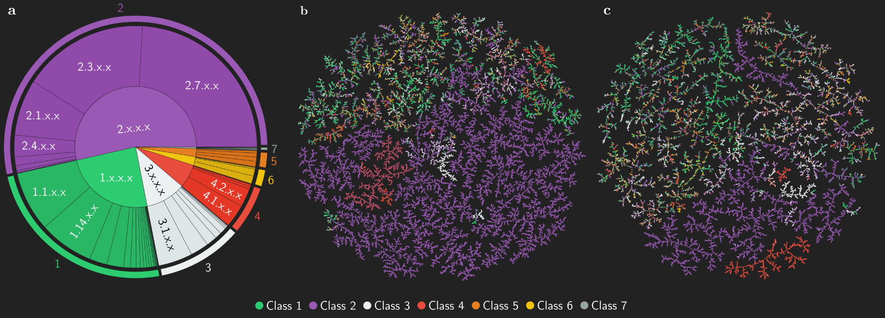

# :leaves: Biocatalysis Model

Open Access article on Nature Communications: [Biocatalysed Synthesis Planning using Data-driven Learning](https://rdcu.be/cHvk3)

> Probst, D., Manica, M., Nana Teukam, Y.G. et al. Biocatalysed synthesis planning using data-driven learning. Nat Commun 13, 964 (2022). https://doi.org/10.1038/s41467-022-28536-w

```
@article{probst2022biosynthplan, 
year = {2022}, 
title = {{Biocatalysed synthesis planning using data-driven learning}}, 
author = {
  Probst, Daniel and Manica, Matteo and Teukam, Yves Gaetan Nana and Castrogiovanni, 
  Alessandro and Paratore, Federico and Laino, Teodoro
}, 
journal = {Nature Communications}, 
doi = {10.1038/s41467-022-28536-w}, 
pmid = {35181654}, 
pages = {964}, 
number = {1}, 
volume = {13},
}
```

## Table of Contents

- [Abstract](#abstract)
- [Data](#data)
  - [ECREACT](#ecreact)
  - [Data Sources](#data-sources)
- [Using the Pre-trained Model](#using-the-pre-trained-model)
- [Training your own Model](#training-your-own-model)
  - [Setup Environment](#setup-environment)
  - [Data Pre-processing](#data-pre-precessing)
  - [Training using OpenNMT-py](#training-using-opennmt-py)
  - [Evaluation](#evaluation)

## Abstract

Enzyme catalysts are an integral part of green chemistry strategies towards a more sustainable and resource-efficient chemical synthesis. However, the use of biocatalysed reactions in retrosynthetic planning clashes with the difficulties in predicting the enzymatic activity on unreported substrates and enzyme-specific stereo- and regioselectivity. As of now, only rule-based systems support retrosynthetic planning using biocatalysis, while initial data-driven approaches are limited to forward predictions. Here, we extend the data-driven forward reaction as well as retrosynthetic pathway prediction models based on the Molecular Transformer architecture to biocatalysis. The enzymatic knowledge is learned from an extensive data set of publicly available biochemical reactions with the aid of a new class token scheme based on the enzyme commission classification number, which captures catalysis patterns among different enzymes belonging to the same hierarchy. The forward reaction prediction model (top-1 accuracy of 49.6%), the retrosynthetic pathway (top-1 single-step round-trip accuracy of 39.6%) and the curated data set are made publicly available to facilitate the adoption of enzymatic catalysis in the design of greener chemistry processes.

## Data

Enzymatic reactions and the accompanying EC numbers were extracted from four databases, namely Rhea, BRENDA, PathBank, and MetaNetX and merged into a new data set, named ECREACT, containing enzyme-catalysed reactions with the respective EC number.

### ECREACT

The ECREACT data set contains samples of all 7 EC classes (1: Oxidoreductases, 2: Transferases, 3: Hydrolases, 4: Lyases, 5: Isomerases, 6: Ligases, 7: Translocases) distributed as shown in (a). The distributions of the substrates and products are shown in the TMAPS (b) and (c) respectively.



The data set is available as a `.csv` file in the following format:

```csv
rxn_smiles,ec,source
CC=O.O.O=O|1.2.3.1>>CC(=O)[O-],1.2.3.1,brenda_reaction_smiles
CC(N)=O.O|3.5.1.4>>CC(=O)O,3.5.1.4,brenda_reaction_smiles
...
```

The field `rxn_smiles` is a reaction SMILES extended with the EC number on the reactant side. The reactants and the EC number are separated by a pipe `|`. The field `ec` is the EC number. Be aware that they can also contain entries such as `1.20.1.M1` or `1.14.-.-`. The field `source` describes the source database of the reaction information.

**[Download ECREACT 1.0](data/ecreact-1.0.csv)**

### Data Sources

ECREACT is composed of data from four publicly accessible databases:

- [Rhea](https://www.rhea-db.org/), an expert-curated knowledgebase of chemical and transport reactions of biological interest - and the standard for enzyme and transporter annotation in UniProtKB. [:file_cabinet:](ftp://ftp.expasy.org/databases/rhea/txt/rhea-reactions.txt.gz)
- [BRENDA](https://www.brenda-enzymes.org/), an information system representing one of the most comprehensive enzyme repositories. [:file_cabinet:](https://www.brenda-enzymes.org/download_brenda_without_registration.php)
- [PathBank](https://pathbank.org/), an interactive, visual database containing more than 100 000 machine-readable pathways found in model organisms such as humans, mice, E. coli, yeast, and Arabidopsis thaliana. [:file_cabinet:](https://pathbank.org/downloads/pathbank_all_biopax.zip)
- [MetaNetX](https://www.metanetx.org/), an online platform for accessing, analyzing and manipulating genome-scale metabolic networks (GSM) as well as biochemical pathways. [:file_cabinet:](https://www.metanetx.org/mnxdoc/mnxref.html)

The contributions by EC class from each of the data sources is shown in the plot below.


## Using the Pre-trained Model

We provide a model for retrosynthetic pathway prediction pre-trained on ECREACT as part of the [IBM RXN for Chemistry](https://rxn.res.ibm.com/) platform. This model can also be used through the [Python wrapper](https://github.com/rxn4chemistry/rxn4chemistry) for the IBM RXN for Chemistry API. You can get a free API key [here](https://rxn.res.ibm.com/rxn/user/profile).

```python
api_key = 'API_KEY'
from rxn4chemistry import RXN4ChemistryWrapper

rxn4chemistry_wrapper = RXN4ChemistryWrapper(api_key=api_key)

# NOTE: you can create a project or set an esiting one using:
# rxn4chemistry_wrapper.set_project('PROJECT_ID')
rxn4chemistry_wrapper.create_project('test_wrapper')
print(rxn4chemistry_wrapper.project_id)

response = rxn4chemistry_wrapper.predict_automatic_retrosynthesis(
    'OC1C(O)C=C(Br)C=C1', ai_model='enzymatic-2021-04-16'
)
results = rxn4chemistry_wrapper.get_predict_automatic_retrosynthesis_results(
    response['prediction_id']
)

print(results['status'])

# NOTE: upon 'SUCCESS' you can inspect the predicted retrosynthetic paths.
print(results['retrosynthetic_paths'][0])
```

## Training your own Model

### Setup Environment

As not all dependencies are available from PyPI for all platforms, we suggest you create a conda environment from the supplied [conda.yml](conda.yml):

```bash
conda env create -f conda.yml
conda activate rxn-biocatalysis-tools
```

Alternatively, :leaves: RXN Biocatalysis Tools are available as a PyPI package and can be installed usining pip; however, not all dependencies will be installed depending on your platform.

```bash
pip install rxn-biocatalysis-tools
```

### Data Pre-processing

The :leaves: RXN Biocatalysis Tools Python package installs a script that can be used to preprocess reaction data. Reaction data can be combined, filtered, or augmented as explained in the usage documentation below. After these initial steps, the data is tokenized and split into training, validation, and testing `src` (reactants + EC) and `tgt` (product/s) files. The output data structure generated by the script is the following, depending on the options set.

```bash
.
└── experiments
    ├── 1
    │   ├── combined.txt
    │   ├── src-test.txt
    │   ├── src-train.txt
    │   ├── src-valid.txt
    │   ├── tgt-test.txt
    │   ├── tgt-train.txt
    │   └── tgt-valid.txt
    ├── 2
    │   ├── combined.txt
    │   ├── src-test.txt
    │   ├── src-train.txt
    │   ├── src-valid.txt
    │   ├── tgt-test.txt
    │   ├── tgt-train.txt
    │   └── tgt-valid.txt
    └── 3
        ├── combined.txt
        ├── src-test.txt
        ├── src-train.txt
        ├── src-valid.txt
        ├── tgt-test.txt
        ├── tgt-train.txt
        └── tgt-valid.txt
```

Usage of the script:

```bash
rbt-preprocess INPUT_FILE ... OUTPUT_DIRECTORY [--remove-patterns=FILE_PATH] [--remove-molecules=FILE_PATH] [--ec-level=LEVEL; default=3] [-max-products=MAX_PRODUCTS; default=1] [--min-atom-count=MIN_ATOM_COUNT; default=4] [--bi-directional] [--split-products] 
```

| Argument / Option   | Example                   | Description                                                  | Default    |
|---------------------|---------------------------|--------------------------------------------------------------|------------|
| INPUT_FILE ...      | file1.csv file2.csv       | File(s) containing enzymatic reaction SMILES<sup>1</sup>     |            |
| OUTPUT_DIRECTORY    | /output/directory/        | The directory to which output files will be written          |            |
| --remove-patterns   | patterns.txt              | SMARTS patterns for molecules to be removed<sup>2</sup>      |            |
| --remove-molecules  | molecules.txt             | Molecule SMILES to be removed<sup>3</sup>                    |            |
| --ec-level          | --ec-level 1 --ec-level 2 | The number of EC levels to be exported, can be repreated     | 3          |
| --max-products      | --max-products 1          | The max number of products (rxns with more are dropped)      | 1          |
| --min-atom-count    | --min-atom-count 4        | The min atom count (smaller molecules are removed)           | 4          |
| --bi-directional    | --bi-directional          | Whether to create the inverse of every reaction<sup>4</sup>  |            |
| --split-products    | --split-products          | Whether to split reactions with multiple prodcuts<sup>5</sup>|            |

<sup>1</sup>Example of an enzymatic reaction SMILES: `CC(N)=O.O|3.5.1.4>>CC(=O)O`<br />
<sup>2</sup>See [patterns.txt](data/patterns.txt) for an example<br />
<sup>3</sup>See [molecules.txt](data/molecules.txt) for an example<br />
<sup>4</sup>Example: For the reaction `CC(N)=O.O|3.5.1.4>>CC(=O)O`, the reaction `CC(=O)O|3.5.1.4>>CC(N)=O.O` will be added<br />
<sup>5</sup>Example: The reaction `A|3.5.1.4>>B.C` is split into reactions `A|3.5.1.4>>B` and `A|3.5.1.4>>C`<br />

### Training using OpenNMT-py

The first step in the OpenNMT is to run `onmt_preprocess` for both the forward and backward models. In the examples below, the data with 3 EC-levels is used. You will probably have to adapt the paths, depending on your directory structure and platform.

The pre-processed USPTO files can be found [here](https://github.com/rxn4chemistry/OpenNMT-py/tree/carbohydrate_transformer/data/uspto_dataset).

``` bash
DATASET=data/uspto_dataset
DATASET_TRANSFER=experiments/3

# forward
onmt_preprocess -train_src "${DATASET}/src-train.txt" "${DATASET_TRANSFER}/src-train.txt" \
    -train_tgt "${DATASET}/tgt-train.txt" "${DATASET_TRANSFER}/tgt-train.txt" -train_ids uspto transfer \
    -valid_src "${DATASET}/src-valid.txt" -valid_tgt "${DATASET_TRANSFER}/tgt-valid.txt" \
    -save_data "preprocessing/multitask_forward" \
    -src_seq_length 3000 -tgt_seq_length 3000 \
    -src_vocab_size 3000 -tgt_vocab_size 3000 \
    -share_vocab

# backward
onmt_preprocess -train_src "${DATASET}/tgt-train.txt" "${DATASET_TRANSFER}/tgt-train.txt" \
    -train_tgt "${DATASET}/src-train.txt" "${DATASET_TRANSFER}/src-train.txt" -train_ids uspto transfer \
    -valid_src "${DATASET}/tgt-valid.txt" -valid_tgt "${DATASET_TRANSFER}/src-valid.txt" \
    -save_data "preprocessing/multitask_backward" \
    -src_seq_length 3000 -tgt_seq_length 3000 \
    -src_vocab_size 3000 -tgt_vocab_size 3000 \
    -share_vocab
```

Once the OpenNMT pre-preprocessing has finished, the actual training can be started:

```bash
# if forward
DATASET="preprocessing/multitask_forward"
OUTDIR="/model/multitask_forward"
LOGDIR="/logs/forward"
# end if

# if backward
DATASET="preprocessing/multitask_backward"
OUTDIR="model/multitask_backward"
LOGDIR="logs/backward"
# end if

W1=9
W2=1

onmt_train -data ${DATASET} \
    -save_model ${OUTDIR} \
    -data_ids uspto transfer --data_weights ${W1} ${W2} \
    -seed 42 -gpu_ranks 0 \
    -train_steps 250000 -param_init 0 \
    -param_init_glorot -max_generator_batches 32 \
    -batch_size 6144 -batch_type tokens \
    -normalization tokens -max_grad_norm 0  -accum_count 4 \
    -optim adam -adam_beta1 0.9 -adam_beta2 0.998 -decay_method noam \
    -warmup_steps 8000 -learning_rate 2 -label_smoothing 0.0 \
    -layers 4 -rnn_size  384 -word_vec_size 384 \
    -encoder_type transformer -decoder_type transformer \
    -dropout 0.1 -position_encoding -share_embeddings  \
    -global_attention general -global_attention_function softmax \
    -self_attn_type scaled-dot -heads 8 -transformer_ff 2048 \
    --tensorboard --tensorboard_log_dir ${LOGDIR}
```

### Evaluation

The test set is evaluated using `onmt_translate`. Three new files are generated:

- `tgt-pred.txt` (forward prediction)
- `src-pred.txt` (backward prediction)
- `tgt-pred-rtrp.txt` (roundtriip prediction, a backward prediction followed by a forward prediction)

Before the roundtrip prediction, the SMILES in `src-pred.txt` should be standardized using the script `rbt-preprocess`. The script does not edit the file in place, so good practise is to rename `src-pred.txt` to `src-pred-noncanon.txt` and then run:

```bash
rbt-canonicalize src-pred-noncanon.txt src-pred.txt
```

Example evaluation scripts:

```bash
# forward prediction

DATASET_TRANSFER="experiments/3"

# Get the newest file from the model directory
MODEL=$(ls model/multitask_forward*.pt -t | head -1)

onmt_translate -model "${MODEL}" \
    -src "${DATASET_TRANSFER}/src-test.txt" \
    -output "${DATASET_TRANSFER}/tgt-pred.txt" \
    -n_best 10 -beam_size 10 -max_length 300 -batch_size 64 \
    -gpu 0
```

```bash
# backward prediction

DATASET_TRANSFER="experiments/3"

# Get the newest file from the model directory
MODEL=$(ls model/multitask_backward*.pt -t | head -1)

onmt_translate -model "${MODEL}" \
    -src "${DATASET_TRANSFER}/tgt-test.txt" \
    -output "${DATASET_TRANSFER}/src-pred.txt" \
    -n_best 10 -beam_size 10 -max_length 300 -batch_size 64 \
    -gpu 0
```

```bash
# roundtrip prediction

DATASET_TRANSFER="experiments/3"

# Get the newest file from the model directory
MODEL=$(ls model/multitask_forward*.pt -t | head -1)

onmt_translate -model "${MODEL}" \
    -src "${DATASET_TRANSFER}/src-pred.txt" \
    -output "${DATASET_TRANSFER}/tgt-pred-rtrp.txt" \
    -n_best 1 -beam_size 5 -max_length 300 -batch_size 64 \
    -gpu 0
```

The :leaves: RXN Biocatalysis Tools PyPI package contains an evaluation script that calculates accuracies from the files produced above. For these examples, the `INPUT_FOLDER` is the same as `DATASET_TRANSFER`, `--n-best-fw`, `--top-n-fw`, `--top-n-bw`, `--top-n-rtr` are all set to `10`.

```bash
rbt-evaluate INPUT_FOLDER --name=NAME [--n-best-fw=N_BEST_FW; default=5] [--n-best-bw=N_BEST_BW; default=10] [--n-best-rtr=N_BEST_RTR; default=1] [--top-n-fw=TOP_N_FW; default=1] [--top-n-fw=TOP_N_FW; default=1] [--top-n-bw=TOP_N_BW; default=1] [--top-n-rtr=TOP_N_RTR; default=1] [--top-n-range] [--isomeric-smiles | --no-isomeric-smiles; default:--isomeric-smiles]
```

| Argument / Option   | Example                   | Description                                                  | Default    |
|---------------------|---------------------------|--------------------------------------------------------------|------------|
| INPUT_FOLDER        | /input/directory/         | The folder containing the src and tgt files                  |            |
| --name              | experiment-3              | The name of the output evaluation csv file                   |            |
| --n-best-fw         | --n-best-fw 10            | The number of calculated tgt predictions per src             | 5          |
| --n-best-bw         | --n-best-bw 10            | The number of calculated src predictions per tgt             | 10         |
| --n-best-rtr        | --n-best-rtr 1            | The number of calculated (roundtrip) tgt predictions per predicted src| 1          |
| --top-n-fw          | --top-n-fw 10             | The number of forward predictions to consider in the evaluation       | 1          |
| --top-n-bw          | --top-n-bw 10             | The number of backward predictions to consider in the evaluation      | 1          |
| --top-n-rtr         | --top-n-rtr 10            | The number of roundtrip predictions to consider in the evaluation     | 1          |
| --top-n-range       | --top-n-range             | Whether to consider the forward, backward, and roundtrip predictions *up to* the respective top-n numbers in the evaluation |            |
| --isomeric-smiles   | --isomeric-smiles         | Do **not** ignore stereochemistry during the evaluation      |            |
| --no-isomeric-smiles| --no-isomeric-smiles      | Ignore stereochemistry during the evaluation                 |            |

The evaluation will produce multiple new files in `INPUT_FOLDER`: A `.csv` file with the fields `metric`, `type`, `top`, `ec`, and `value`; and multiple files containing correct and incorrect forward, backward, and roundtrip predictions for each top-n. In addition, the accuracy of *only* predicting the EC number is calculated and the respective files written out as well.
